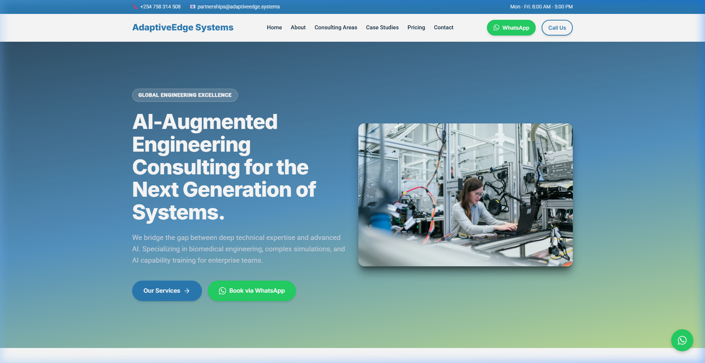
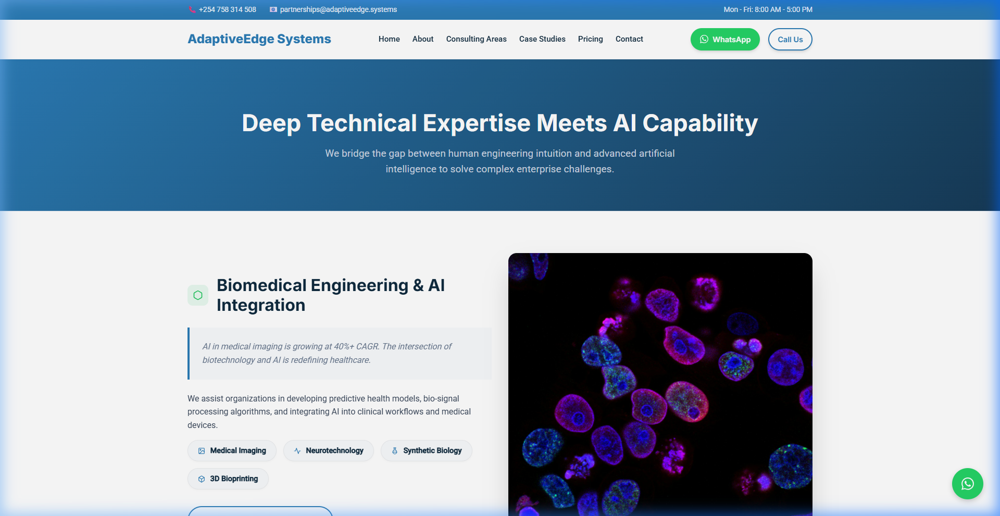
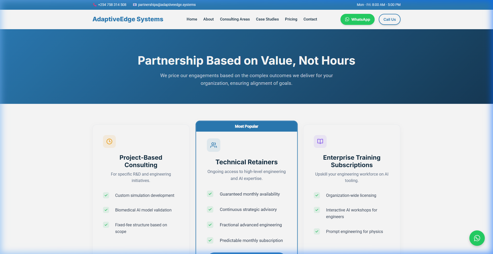

# AdaptiveEdge Systems — Official Website

> AI-augmented engineering consulting for the next generation of biomedical, electrical, and industrial systems.  
> **Built for Africa. Trusted Globally.**

---

## 🌐 Live Site

Access the live development server on your local network:
```
http://10.225.212.70:5174
```

---

## 📸 Screenshots

### Homepage


### Consulting Areas (Services)


### Pricing


---

## 📁 Project Structure

```
adaptive_edge_systems/
├── index.html                  # Homepage
├── about/index.html            # About page
├── services/index.html         # Consulting Areas (main service page)
├── case-studies/index.html     # Case Studies
├── pricing/index.html          # Pricing tiers
├── contact/index.html          # Contact form
├── marketing/                  # Marketing assets & copy
├── public/                     # Static assets (images)
│   ├── engineering-expertise.png
│   ├── matlab-simulation.png
│   ├── matlab-ai-toolbox.png
│   └── vital-signs-monitor.png
├── src/
│   ├── css/style.css           # Global design system (all tokens, components)
│   └── js/main.js              # Scroll animations, mobile menu, interactions
├── vite.config.js              # Vite MPA configuration
└── package.json
```

---

## 🚀 Getting Started

### Prerequisites
- Node.js v18+
- npm

### Install dependencies
```bash
npm install
```

### Start development server (local network accessible)
```bash
npm run dev
```
> Vite will print all available network addresses. Use the `Network:` URL to access from other devices on the same WiFi.

### Build for production
```bash
npm run build
```
Output goes to the `dist/` folder, ready for deployment.

### Preview production build
```bash
npm run preview
```

---

## 🎨 Design System

The design system lives entirely in `src/css/style.css`.

| Token | Value | Usage |
|---|---|---|
| `--primary` | `#2B7CB6` | Buttons, links, accents |
| `--primary-dark` | `#163A56` | Dark navy backgrounds |
| `--accent` | `#8DC63F` | CTA buttons (green) |
| `--secondary` | `#0F2A3E` | Footer, dark sections |
| `--bg-light` | `#F8FAFC` | Alternate section backgrounds |

**Key component classes:**
- `.btn` `.btn-accent` `.btn-outline` — Pill-shaped buttons
- `.card` — Glassmorphism cards with hover glow
- `.focus-pill` — Interactive specialty badges
- `.modern-icon-container` — Soft-color SVG icon wrappers
- `.fade-in-section` / `.animate-element` — Scroll animation classes

---

## 📄 Consulting Areas (Services)

The `/services/` page covers 5 specialised consulting categories:

1. **Biomedical Engineering & AI Integration** — Medical imaging, neurotechnology, synthetic biology, 3D bioprinting
2. **Biomedical Signal Processing** — EEG/ECG/EMG analysis, arrhythmia detection, physiological modelling, wearable pipelines
3. **Advanced Simulation & Modeling** — Control systems, power systems, thermal/fluid dynamics
4. **MATLAB & Simulink — AI-Integrated Engineering** — Model-Based Design, S-functions, HIL testing, AI Toolbox
5. **Enterprise AI Upskilling** — AI literacy, prompt engineering for physics, surrogate model evaluation

---

## 📞 Contact

- **Email:** partnerships@adaptiveedge.systems
- **Phone:** +254 758 314 508
- **WhatsApp:** [wa.me/254758314508](https://wa.me/254758314508)

---

## 📝 Strategy & Content

See `adaptiveedge_systems_strategy.md` for the full content and SEO strategy roadmap.

---

© 2026 AdaptiveEdge Systems. All rights reserved.
